```mermaid
%%{init: {'theme':'dark', 'themeVariables': { 'primaryColor':'#00F5FF','primaryTextColor':'#fff','primaryBorderColor':'#FF6B6B','lineColor':'#FFD93D','secondaryColor':'#6BCF7F','tertiaryColor':'#A594F9'}}}%%
graph LR
    A[💡 Ideation] -->|Research| B[🎨 Design]
    B -->|Prototype| C[⚙️ Backend]
    C -->|Build| D[🖥️ Frontend]
    D -->|Integrate| E[🤖 AI Features]
    E -->|Test| F[🧪 QA]
    F -->|Launch| G[🚀 Deploy]
    G -->|Monitor| H[📊 Analytics]
    H -->|Iterate| A
```

<div align="center">

<!-- PREMIUM HEADER -->


<br/>

<!-- GLOWING STATS -->


<br/><br/>

<!-- PROFILE BADGES -->


</div>

---


##  About Me

<div align="center">

**🧠 Full Stack Developer × AI Engineer**

I design and build end-to-end systems — from polished UI layers to secure backends and AI-powered decision engines.

</div>

<table align="center">
<tr>
<td align="center" width="50%">

### 👨‍💻 Quick Facts

🎯 **Role:** Full Stack Developer × AI Engineer  
📍 **Location:** India 🇮🇳  
💼 **Experience:** 2+ Years Freelance  
🚀 **Focus:** AI Systems, SaaS Products  
✅ **Status:** Open for Collaboration  

</td>
<td align="center" width="50%">

### 🎓 Achievements

🏅 **Top-5** Gen AI Hackathon Winner  
📊 **25+** Production-Grade Projects  
🎓 **50+** Technical Certifications  
⭐ **100+** Days Contribution Streak  
🤝 **2 Years** Professional Experience  

</td>
</tr>
</table>

<div align="center">

> ### 💡 Philosophy
> **"Good software works. Great software understands."**

*Building with clarity, intent, and systems thinking*

</div>

---


##  Tech Stack

<div align="center">

### ⚡ Languages & Core


### 🎨 Frontend Development


### ⚙️ Backend & Databases


<br/>


### 🤖 AI/ML Stack


### 🛠️ Tools & DevOps


</div>

---


##  GitHub Analytics

<div align="center">


</div>

---


##  Featured Projects

<div align="center">

<table>
<tr>
<td width="50%" valign="top">

### 🚀 AI-LearnLabs

<div align="center">

<a href="https://github.com/Purna375/AI-LearnLabs" target="_blank">

</a>

**AI-Powered Learning Management System**


Full-stack LMS with authentication, RBAC, REST APIs, complex dashboards, and AI-driven content generation

</div>

</td>
<td width="50%" valign="top">

### ⚡ Hisame AI

<div align="center">


**AI Application Generation Platform**


Production SaaS with live editors, dashboards, async workflows, and AI API integrations

</div>

</td>
</tr>

<tr>
<td width="50%" valign="top">

### 💬 Threadeo 2.0

<div align="center">

<a href="https://github.com/Purna375/Threadeo2.O" target="_blank">

</a>

**Full Stack Social Platform**


Threads-inspired app with communities, nested comments, real-time notifications

</div>

</td>
<td width="50%" valign="top">

### 🧠 ML Projects

<div align="center">


**Applied Machine Learning**


🔬 [Disease Prediction](https://github.com/Purna375/Disease-Prediction)  
📰 [Fake News Detection](https://github.com/Purna375/Fake_News_Detection)  
❤️ [Heart Disease Prediction](https://github.com/Purna375/Heart-Disease)  
🎹 Virtual Piano - Hand Gesture Recognition

</div>

</td>
</tr>
</table>

</div>

---


##  Development Workflow

<div align="center">



</div>

---


##  Achievements

<div align="center">

| 🎯 Category | 📊 Achievement | 🏆 Status |
|:------------|:---------------|:----------|
| 🅠**Competition** | Top-5 Gen AI Hackathon |  |
| 💼 **Experience** | 2+ Years Freelance |  |
| 📊 **Projects** | 25+ Production Repos |  |
| 📠**Learning** | 50+ Certifications |  |

<details>
<summary><b>🎓 View Certification Portfolio (50+)</b></summary>
<br>

### Featured Certifications

**Google**
- ✅ UI/UX Professional Certificate
- ✅ IT Automation with Python

**Meta**
- ✅ Programming with JavaScript
- ✅ React Basics
- ✅ Front-End Developer

**freeCodeCamp**
- ✅ Responsive Web Design
- ✅ JavaScript Algorithms & Data Structures

**Industry**
- ✅ Postman API Student Expert
- ✅ Git Version Control
- ✅ AWS Cloud Practitioner

*... and 40+ more specialized certifications*

</details>

</div>

---


##  Skill Proficiency

<div align="center">


<br/><br/>


</div>

---


##  Contribution Activity

<div align="center">

<picture>
  <source media="(prefers-color-scheme: dark)" srcset="https://raw.githubusercontent.com/Purna375/Purna375/output/github-contribution-grid-snake-dark.svg">
  <source media="(prefers-color-scheme: light)" srcset="https://raw.githubusercontent.com/Purna375/Purna375/output/github-contribution-grid-snake.svg">
  
</picture>

</div>

---


##  Daily Inspiration

<div align="center">


</div>

---


##  Let's Connect

<div align="center">

### 🤝 Open for Collaboration & Freelance Projects

<a href="https://www.linkedin.com/in/purnachandrashekar/">
  
</a>
<a href="mailto:gurnachandrashekar@gmail.com">
  
</a>
<a href="https://purna-dev-portfolio.vercel.app">
  
</a>
<a href="https://github.com/Purna375">
  
</a>

<br/><br/>

| 💼 Service | 📬 Channel | ⚡ Response Time |
|:-----------|:-----------|:----------------|
| 🚀 Freelance Work | [Email Me](mailto:gurnachandrashekar@gmail.com) | < 24 hours |
| 🤝 Collaboration | [LinkedIn DM](https://www.linkedin.com/in/purnachandrashekar/) | < 48 hours |
| 💡 Project Inquiry | [Visit Portfolio](https://purna-dev-portfolio.vercel.app) | < 24 hours |
| ⭐ Open Source | [GitHub](https://github.com/Purna375) | Community |

<br/>

### 🎯 Current Status

```
✅ Available for Freelance Projects
🚀 Focus: AI-Powered SaaS Applications
🤝 Looking For: Innovative Collaborations
💡 Interests: Full Stack + AI/ML Integration
```

<br/>


<br/><br/>


</div>
